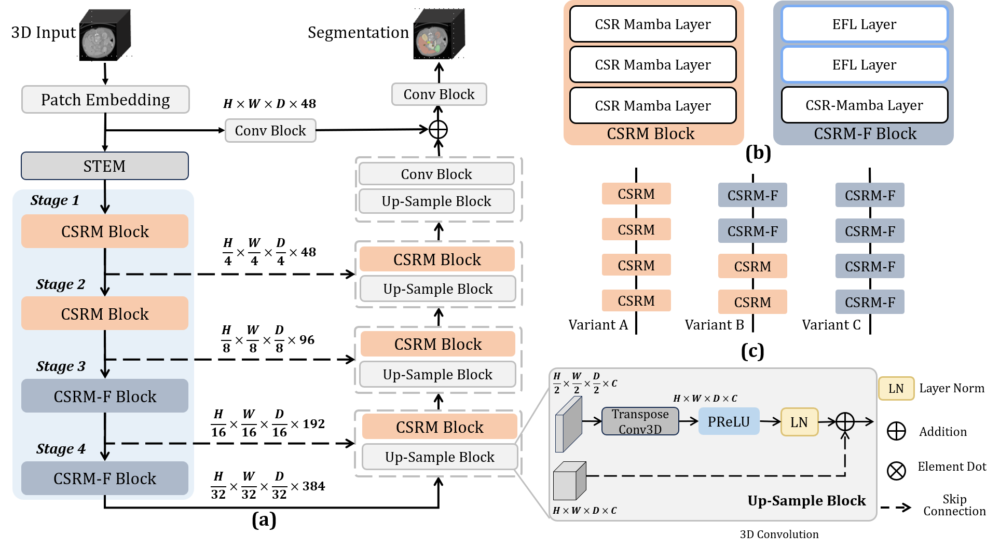
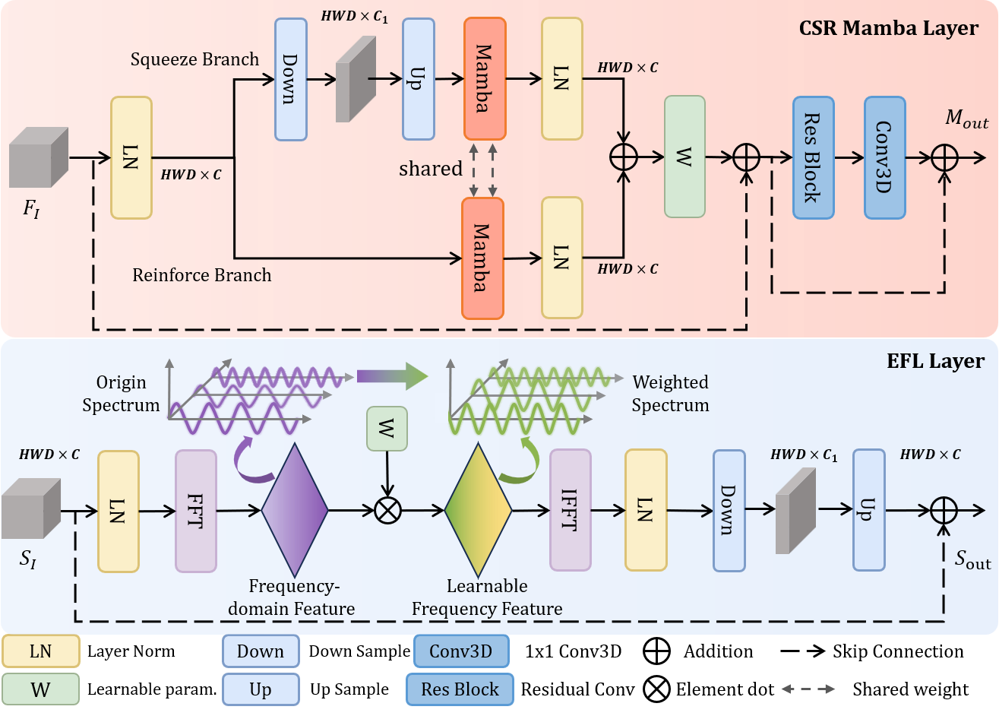
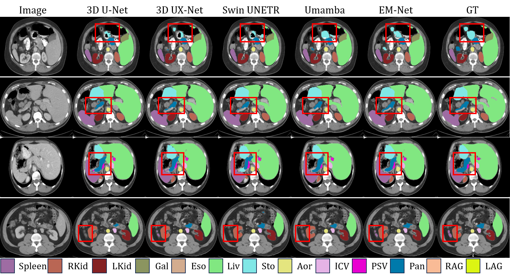

# EM-Net
The code for "EM-Net: Efficient Channel and Frequency Learning with Mamba for 3D Medical Image Segmentation" [Arxiv](https://arxiv.org/abs/2409.17675) | MICCAI 2024

## 🚧 Under Construction 🚧

We're excited to share our work with you! Our team is currently tidying up the codebase and preparing it for public release. We appreciate your patience and interest.

## EM-Net: Efficient Channel and Frequency Learning with Mamba for 3D Medical Image Segmentation

> ### The overall of EM-Net.

